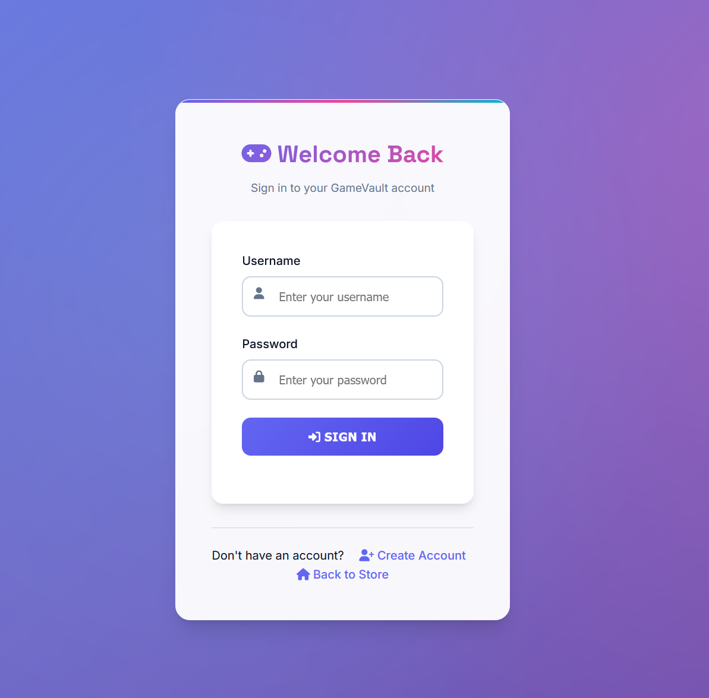

Game-Vault is an e-commerce website built with PHP, designed as a sleek and modern storefront for selling games. Users can create accounts and log in to browse and purchase titles. The platform also includes a dedicated admin dashboard, allowing administrators to view store statistics, add new games, and manage existing listings with ease.
## Screenshots of the website

   
  <em>Homepage</em>

   
  <em>User Dashboard</em>

   
  <em>Admin Dashboard</em>

